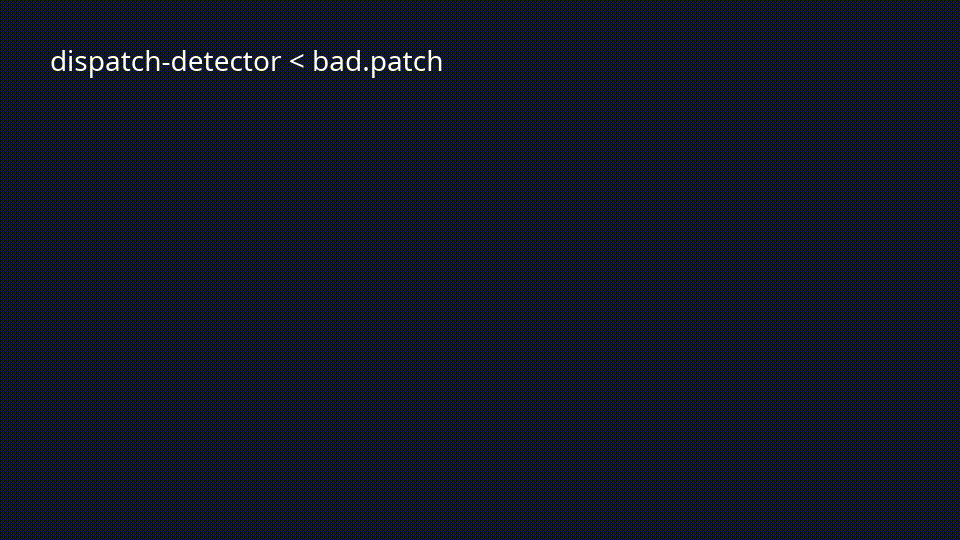

# dispatch.ai

Pattern 3 autonomous coding CLI with a verifier you can trust.

Plan → execute → verify → replan. Each step's diff is checked by a deterministic detector (placeholder stubs, fake imports) and a Claude judge before it is applied to your repo. The loop halts cleanly when a budget is hit, the verifier keeps failing, or you Ctrl-C.

> **Status:** the full live loop is verified end-to-end against the Anthropic API shape (planner → executor → judge → diff applied). Unit suite, typecheck, lint, build, and `verify:release` are all green; run `bun test && bun run verify:release` for current numbers. Publishing to npm/Homebrew and the launch workflow are external follow-ups.

## Use

Install both the orchestrator CLI and the detector:

```bash
npm install -g @dispatch-ai/cli @dispatch-ai/detector
export ANTHROPIC_API_KEY=sk-ant-...
dispatch run "add a /healthz endpoint and a test for it"
```

You can also pull the prebuilt binary with the install script (no npm required):

```bash
curl -fsSL https://raw.githubusercontent.com/dispatch-ai-labs/dispatch-ai/main/install.sh | sh
```

What happens on a run:

1. The planner turns your goal into 1–8 concrete steps.
2. For each step, the executor returns a unified git diff.
3. The verifier (deterministic detector + Claude judge) scores the diff. Failures trigger a replan, up to 3 times.
4. Verified diffs are applied with `git apply`. You get a `dispatch-run-<id>/manual-takeover.json` artifact if the run halts.

Common flags:

```bash
dispatch run "<goal>"                        # default: --gate-on-warn (prompts on warn verdicts)
dispatch run "<goal>" --gate-every-step      # prompt after every step
dispatch run "<goal>" --auto --docker        # no prompts; diffs apply inside the sandbox image
dispatch run "<goal>" --max-cost-usd 2.50    # halt with a takeover artifact once spend exceeds budget
dispatch run "<goal>" --override             # accept warn verdicts without prompting (use sparingly)
```

`--auto` outside Docker requires recorded consent:

```bash
printf 'I accept' | dispatch consent-auto
```

Run without an API key in CI by setting `DISPATCH_FAKE_RUN=1` — the run uses fake planner/executor/verifier stubs and exits 0 on a tiny synthetic diff. Useful for smoke-testing the binary surface.

State is persisted at `~/.dispatch/state.sqlite`. Each run gets a `runId` you can reference in halt artifacts.

The detector ships standalone for CI gating:

```bash
git diff | dispatch-detector --repo .
# exit 0 pass, 1 warn, 2 fail
git diff | dispatch-detector --repo . --judge   # adds Claude judge when ANTHROPIC_API_KEY is set
```

## Packages

| Package | Description |
|---|---|
| `@dispatch-ai/detector` | Placeholder + fake-import detector for AI-generated Python diffs. Ships standalone on npm. Binary: `dispatch-detector`. |
| `@dispatch-ai/cli` | The Pattern 3 orchestrator CLI: plan → step-execute → verify → replan. Binary: `dispatch`. |
| `@dispatch-ai/shared` | Shared zod schemas (Plan, Step, StepResult, VerificationResult, ReplanInput, DispatchConfig). |

## Comparison

| Tool | Primary shape | dispatch.ai difference |
|---|---|---|
| Aider | Conversational pair-programming loop | Goal-submission workflow with explicit verifier gates. |
| OpenHands | Multi-agent manager/worker system | Pattern 3 linear execution with verifier-first reliability. |
| Plandex | Plan-first coding workflow | Placeholder and fake-import detector is a first-class gate. |

## Open-core line

OSS, Apache 2.0:
- Core orchestrator (Pattern 3: plan → execute → verify → replan).
- Python verifier (placeholder detection + minimal import resolver + LLM judge).
- CLI, local sandbox, optional Docker sandbox.

Hosted SaaS / paid (later, never relicensed from OSS):
- Managed runs without local sandbox.
- Multi-language verifiers (TS, Go, Rust, Java).
- SSO, audit logs, RBAC, on-prem deploy.
- Support contract.

## Development

```bash
bun install
bun run typecheck
bun run lint
bun test
bun run eval:snapshots
```

## Install Surfaces

Local package smoke equivalents:

```bash
npm exec --package ./packages/cli -- dispatch --version
npm exec --package ./packages/detector -- dispatch-detector --version
```

Published package commands:

```bash
npm install -g @dispatch-ai/cli @dispatch-ai/detector
dispatch run "add caching" --gate-on-warn
dispatch-detector < diff.patch
npx @dispatch-ai/cli run "add caching" --gate-on-warn
npx @dispatch-ai/detector < diff.patch
# unscoped alias for short CI commands
npx dispatch-detector < diff.patch
# or pull the prebuilt binary
curl -fsSL https://raw.githubusercontent.com/dispatch-ai-labs/dispatch-ai/main/install.sh | sh
```

The unscoped `dispatch-detector` name is published as a short alias of `@dispatch-ai/detector`. The bare `dispatch` and `dispatch-ai` names on npm are squatted by unrelated parties; users install via the scoped `@dispatch-ai/cli` instead.

## Detector



```bash
git diff | bun packages/detector/src/bin.ts --repo .
```

Exit codes are CI-friendly:

| Code | Verdict |
|---:|---|
| 0 | pass |
| 1 | warn |
| 2 | fail |

The deterministic detector fails fast on placeholder stubs and fake imports. If `--judge` is passed with `ANTHROPIC_API_KEY`, the Claude judge runs only after deterministic checks pass.

## CLI Safety

`--gate-on-warn` is the default approval mode. `dispatch run "<goal>" --auto` refuses unless `--docker` is present or first-run consent has been recorded with:

```bash
printf 'I accept' | bun packages/cli/src/bin.ts consent-auto
```

## Release

```bash
git tag v0.x.y
git push --tags
```

The release workflow builds Bun-compiled binaries for darwin-arm64, darwin-x64, linux-x64, linux-arm64, windows-x64; publishes the core npm packages plus compatibility packages; updates the Homebrew formula in `homebrew-dispatch-ai`; attaches binaries to the GitHub Release.

## AI use disclosure

This project was built with substantial assistance from AI coding tools. AI was used to draft code, tests, eval snapshots, and documentation. All code was reviewed before being committed, and the project's own verifier (placeholder detection, fake-import resolution, Claude judge) is the trust boundary the codebase enforces on AI-generated diffs at runtime.

What this means in practice:

- The verifier is the contract. If you find AI-shaped failure modes (placeholder stubs, fabricated imports, shallow implementations) that slipped past the detector, that is a bug — please file an issue with the diff and the verdict you expected.
- LLM output is never trusted unchecked. Diffs are parsed through zod schemas, gated by `git apply --check` before any working tree write, and surfaced for human approval on warn verdicts by default.
- Costs and failures are observable. Every run writes a `runId` to `~/.dispatch/state.sqlite`; halts write a `manual-takeover.json` artifact next to your repo so a human can resume.

If your organization restricts AI-assisted code, treat this project the same way you would any other AI-touched dependency: read the diff, run the verifier, and pin a version.
